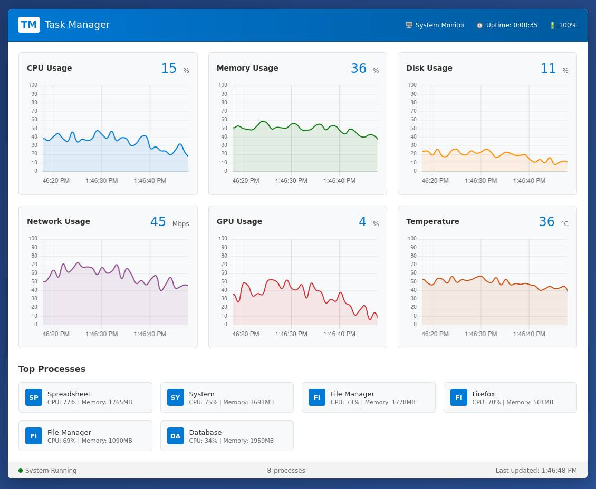

# @aziham/chartjs-plugin-streaming

[](https://www.npmjs.com/package/@aziham/chartjs-plugin-streaming) [](https://opensource.org/licenses/MIT) [](https://github.com/chartjs/awesome)

[Chart.js](https://www.chartjs.org) plugin for live streaming data with real-time data visualization.

## 🍴 Fork History

This is a fork of the original [chartjs-plugin-streaming](https://github.com/nagix/chartjs-plugin-streaming) by nagix, which appears to be unmaintained.

**Fork Chain:**

- **Original**: [nagix/chartjs-plugin-streaming](https://github.com/nagix/chartjs-plugin-streaming) (unmaintained)
- **Intermediate**: [Robloche/chartjs-plugin-streaming](https://github.com/Robloche/chartjs-plugin-streaming) (no npm package)
- **Current Fork**: [aziham/chartjs-plugin-streaming](https://github.com/aziham/chartjs-plugin-streaming) (this repository)

**Why This Fork Exists:**

- Robloche didn't have time to build and publish an npm package
- Significant modernization and improvements were needed
- Better TypeScript support and developer experience
- Modern build system with Vite
- Simplified project structure

## ✨ Major Changes & Improvements

### 🏗️ **Build System Modernization**

- **Migrated to TypeScript** for better type safety and developer experience
- **Replaced Rollup with Vite** for faster builds and modern tooling
- **Simplified project structure** - removed VuePress docs, CI/CD workflows
- **Reduced dependencies** from ~1,600+ to ~65 packages (96% reduction)
- **Modern package configuration** with proper exports field for bundlers
- **Removed ESLint** - TypeScript provides type safety, making ESLint redundant

### 📦 **Package Structure**

- **Types moved to `src/types/`** following modern TypeScript conventions
- **Proper exports configuration** for ES modules, CommonJS, and TypeScript
- **Multiple build formats**: UMD, ES Module, and Minified versions
- **Source maps** included for debugging

### 🔧 **Technical Enhancements**

- **Fixed build output generation** - all three formats now build correctly
- **Improved TypeScript configuration** with modern compiler options
- **Better development workflow** with `npm run dev` command
- **Streamlined Vite configs** for different build scenarios

## 📋 Requirements

- **Chart.js 4.5.1** or later
- **Node.js 22.14.0** (tested version, may work with earlier versions)
- **Modern browser** with ES2020 support

## 🚀 Installation

```bash
# npm
npm install @aziham/chartjs-plugin-streaming

# yarn
yarn add @aziham/chartjs-plugin-streaming

# pnpm
pnpm add @aziham/chartjs-plugin-streaming
```

## 📖 Usage

For comprehensive documentation and examples, please refer to:

### Documentation

- [Introduction](https://nagix.github.io/chartjs-plugin-streaming/master/guide/)
- [Getting Started](https://nagix.github.io/chartjs-plugin-streaming/master/guide/getting-started.html)
- [Options](https://nagix.github.io/chartjs-plugin-streaming/master/guide/options.html)
- [Data Feed Models](https://nagix.github.io/chartjs-plugin-streaming/master/guide/data-feed-models.html)
- [Integration](https://nagix.github.io/chartjs-plugin-streaming/master/guide/integration.html)
- [Performance](https://nagix.github.io/chartjs-plugin-streaming/master/guide/performance.html)
- [Migration](https://nagix.github.io/chartjs-plugin-streaming/master/guide/migration.html)
- [Tutorials](https://nagix.github.io/chartjs-plugin-streaming/master/tutorials/)
- [Samples](https://nagix.github.io/chartjs-plugin-streaming/master/samples/)

## 🛠️ Development

### Setup

```bash
# Clone repository
git clone https://github.com/aziham/chartjs-plugin-streaming.git
cd chartjs-plugin-streaming

# Install dependencies
npm install

# Build the project
npm run build
```

### Available Scripts

```bash
npm run dev          # Build and start development server with demo
npm run build        # Build all distribution files (UMD, ES, Minified)
```

### Demo

The project includes a comprehensive **Real-time System Monitor** demo:

```bash
npm run dev
```

**Demo Location:** `http://localhost:5173/`



### Project Structure

```
src/
├── helpers/           # Utility functions
├── plugins/           # Chart.js plugins
│   ├── plugin.annotation.ts
│   ├── plugin.streaming.ts
│   ├── plugin.tooltip.ts
│   └── plugin.zoom.ts
├── scales/            # Custom scales
│   └── scale.realtime.ts
├── types/             # TypeScript definitions
│   └── index.d.ts
├── index.ts           # Main entry point
└── index.esm.ts       # ES module entry
```

### Testing Locally

```bash
# Build package
npm run build

# Create package file
npm pack

# Install in test project
npm install ./aziham-chartjs-plugin-streaming-3.2.0.tgz
```

## 📦 Build Outputs

The build process generates three formats:

- **`dist/chartjs-plugin-streaming.js`** - UMD format (13.5 kB)
- **`dist/chartjs-plugin-streaming.esm.js`** - ES Module format (18.1 kB)
- **`dist/chartjs-plugin-streaming.min.js`** - Minified UMD format (13.4 kB)

All builds include source maps for debugging.

## 📄 License

MIT License - see [LICENSE.md](LICENSE.md) for details.

## 🤝 Contributing

Contributions are welcome! Please feel free to submit a Pull Request. For major changes, please open an issue first to discuss what you would like to change.
